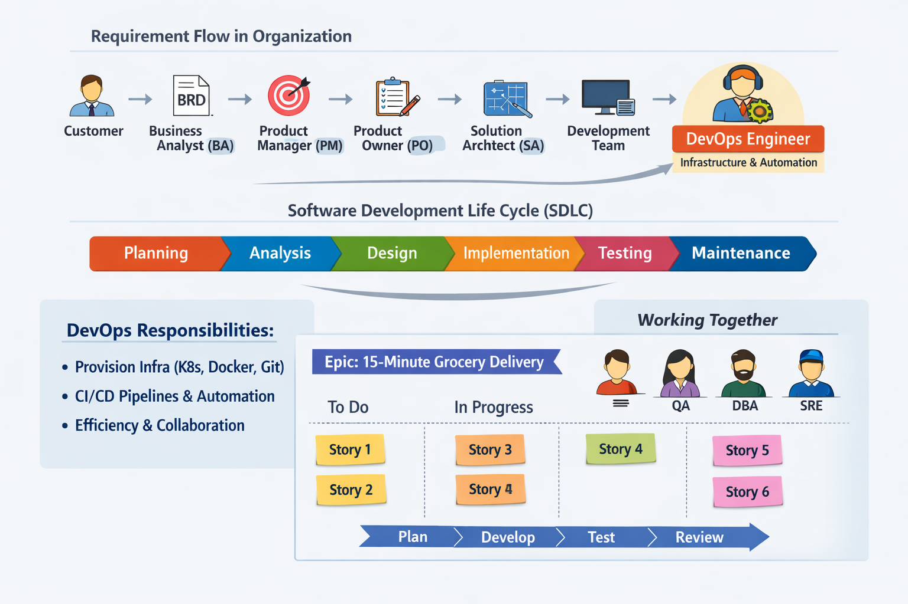

# DevOps Zero to Hero — Learning Journey

This repository documents my structured learning path through DevOps concepts, tools, and practices.  
It consolidates my notes from a 3‑day foundational series.

---

## 📍 Day 1 — Foundations
- **Definition of DevOps**: A culture that improves application delivery speed and quality.
- **Core Pillars**: Automation, Quality, Monitoring/Observability, Continuous Testing.
- **Why DevOps?**: Emerged to replace slow, manual processes involving sysadmins, release engineers, and server admins.
- **Interview Prep**: Introduce yourself with background + DevOps responsibilities.

---

## 📍 Day 2 — Software Development Life Cycle (SDLC)
- **Phases**: Planning → Defining → Designing → Building → Testing → Deployment → Maintenance.
- **Key Documents**:  
  - Software Requirement Specification (SRS)  
  - High‑Level Design (HLD) / Low‑Level Design (LLD)  
- **DevOps Focus Areas**:  
  - Automating **Build, Test, Deploy** phases with CI/CD pipelines.  
- **Agile Context**: Work in sprints, iterative delivery, continuous feedback.

---

## 📍 Day 3 — Organizational Roles & Jira

## 📊 DevOps Workflow Visualization

- **Requirement Flow**:  
  Customer → Business Analyst (BRD) → Product Manager → Product Owner (Epics/Stories) → Solution Architect (HLD/LLD) → Developers → DevOps Engineers.
- **Scrum Teams**: Developers, DevOps, QA, DBAs, SREs, Technical Writers.
- **DevOps Role**:  
  - Provision infra (Kubernetes, Docker, Git repos).  
  - Automate pipelines, integrate testing/security.  
  - Identify efficiency gaps in SDLC.  
- **Jira Workflow**:  
  - PO creates Epics (e.g., “15‑Minute Grocery Delivery”).  
  - Stories assigned to engineers.  
  - Tasks tracked across **To Do → In Progress → Done**.

---

## 🎯 How I Use This
- **Portfolio**: Documenting my DevOps journey for recruiters and peers.  
- **Interview Prep**: Practicing answers to “What is DevOps?” and “Where do you fit in SDLC?”.  
- **Storytelling**: Sharing Jira simulations and workflow visualizations to show practical application.
