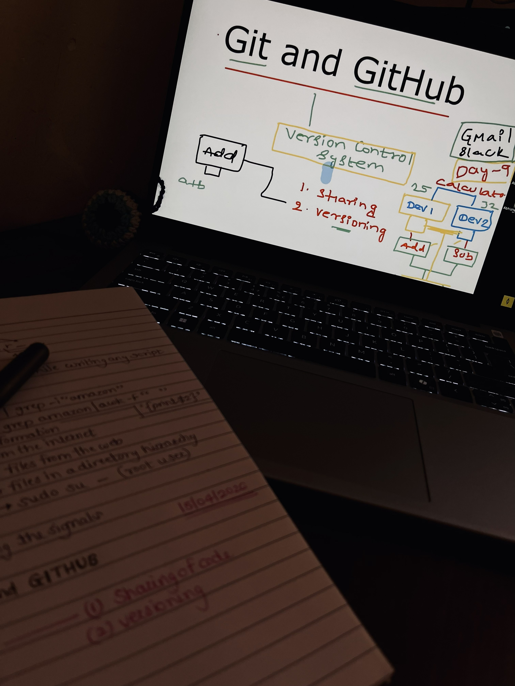

# 💡 The Day I Realized Why Git Exists

## 📖 Story
Imagine this:  
Two developers are building a simple calculator app.  
👨‍💻 Dev 1 writes the **addition** function.  
👩‍💻 Dev 2 writes the **subtraction** function.  

Easy, right? Until they need to merge their work.  
Now there are *hundreds of files*, *dependencies*, and *updates flying around*.  
One sends code over Slack, another over Gmail.  
Soon, chaos reigns — overwritten files, lost changes, and the dreaded “it worked on my machine.”

That’s when I truly understood what Abhishek meant in his DevOps session:  
👉 **Version Control Systems (VCS)** aren’t just tools — they’re *lifelines* for collaboration.

---

## 🧩 Why Version Control Matters
Version control systems solve two major problems:
1. **Sharing code** seamlessly across teams without chaos.  
2. **Versioning** — keeping history intact so you can roll back to “addition of two numbers” after experimenting with “addition of four.”

Earlier systems like **SVN** were *centralized* — one server, one point of failure.  
If that server went down, teamwork stopped.  
Then came **Git**, a *distributed* system where every developer has a full copy of the repo.  
No single point of failure. No chaos. Just control.

---

## 🌐 Git vs GitHub
- **Git** → The open-source distributed version control system that tracks changes locally.  
- **GitHub** → A platform built *on top of Git* that adds collaboration features like:
  - Issue tracking  
  - Code reviews  
  - Project management  
  - Team communication  

Together, they make teamwork scalable and transparent.

---

## ⚙️ Core Git Commands
| Command | Purpose |
|----------|----------|
| `git init` | Initialize a new repository |
| `git add` | Stage changes for commit |
| `git commit -m "message"` | Save a version snapshot |
| `git push` | Share changes to remote repository |
| `git log` | View commit history |
| `git diff` | Compare changes between versions |

---

## 🧠 Key Takeaway
When I type `git add`, `git commit`, and `git push`, I’m not just running commands.  
I’m participating in a system that keeps innovation organized.  

Because **DevOps isn’t just about automation — it’s about building together without breaking each other’s code.**

---

## 🔖 Hashtags
`#DevOpsJourney` `#GitAndGitHub` `#VersionControl` `#LearningByDoing` `#ZeroToHero` `#DevOpsCommunity`
