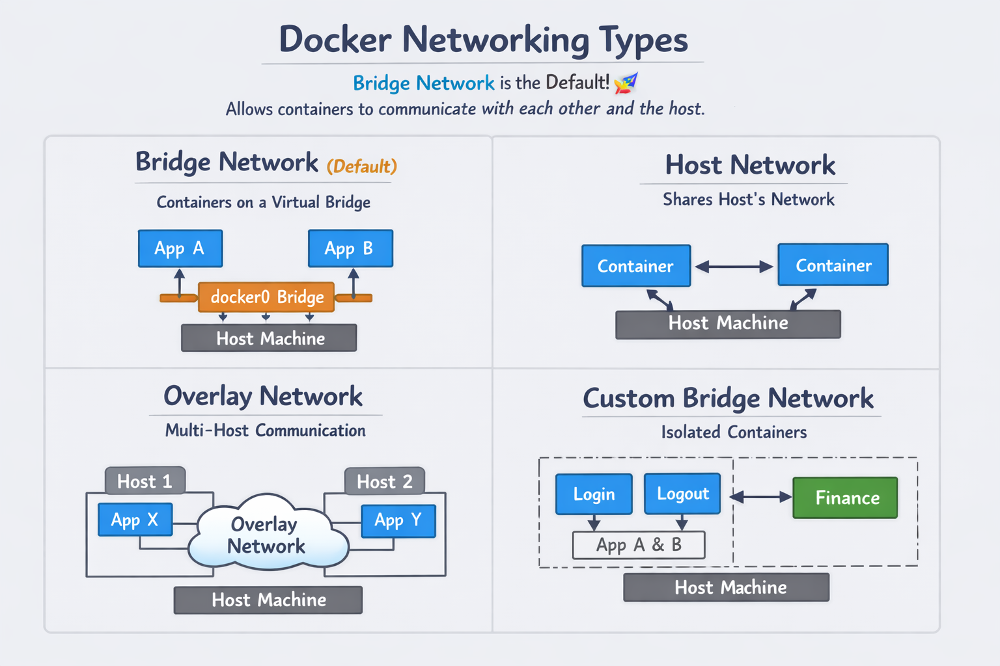

# 🚀 Day 27 – Docker Networking (Made Simple)

## 🧐 Why Networking?
- Containers need a way to **talk to each other** (like frontend ↔ backend).  
- Containers also need to **talk to the host machine**.  
- Sometimes you want them to **stay separate** (like login vs finance apps).

## 🔑 Types of Docker Networks


1. **Bridge (Default)**  
   - Created automatically (`docker0`).  
   - Containers can ping each other and reach the host.  
   - Good for most simple apps.  

2. **Host**  
   - Container shares the host’s network.  
   - Fast, but **not secure** (no isolation).  

3. **Overlay**  
   - Used when you have **multiple hosts** (like in Kubernetes or Swarm).  
   - Lets containers on different machines talk.  
   - More advanced, not needed for beginners.  

4. **Custom Bridge**  
   - You can create your own bridge network.  
   - Useful when you want **isolation** (e.g., finance container separate from login container).  

## 🛠️ Commands You’ll Use
- Run a container with default bridge:  
  ```bash
  docker run -d --name login nginx
  docker run -d --name logout nginx
  ```
- Create a custom bridge network:  
  ```bash
  docker network create secure_network
  ```
- Run a container in that custom network:  
  ```bash
  docker run -d --name finance --network=secure_network nginx
  ```
- Run a container with host network:  
  ```bash
  docker run -d --name host_demo --network=host nginx
  ```
##  ✅ Why Bridge is Default
It allows containers to communicate easily with each other and the host.
Provides a virtual separation (different subnets) while still being simple to use.
Without it, containers wouldn’t be reachable from the host or the internet.

## ✅ Key Takeaways
- **Bridge network** = default, flexible.  
- **Custom bridge** = isolation for sensitive apps.  
- **Host network** = fast but insecure.  
- **Overlay network** = for clusters/multi-host setups.  


Would you like me to also add **simple diagrams (ASCII style)** to visually show how containers connect in each network type? That can make it even easier for beginners to grasp.
